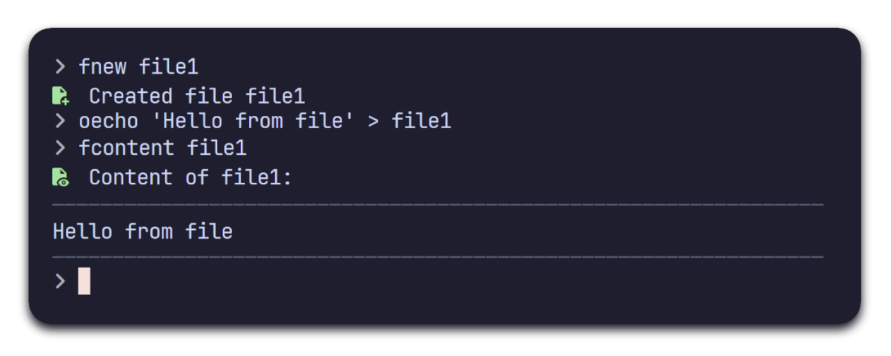

<h3 align="center">
    <br>
    sCore<br>
    
</h3>

<p align="center">
    
</p>

<h3>Note</h3>
This repo is still a work in process. More features are to come out later

<h3 align="center">About</h3>
<b>sCore</b> is a set of enhanced coreutils for basic system mangement<br>
They are targeting new users and simpler design (Who thought <code>cat</code> was a good name for a program that prints a files content??)
<p align="center">
    
</p>

<h3 align="center">Commands</h3>
Current commands include:
<ul>
    <li>
        File management<br>
        <code>fnew, fremove, fcontent, fcopy, fmove</code>
    </li>
    <li>
        Directory management<br>
        <code>dnew, dremove, dlist, dcopy, dmove</code>
    </li>
    <li>
        System management<br>
        <code>senv</code>
    </li>
    <li>
        Input/Output<br>
        <code>oecho</code>
    </li>
</ul>

<h3 align="center">Installing</h3>

```bash
git clone https://github.com/sOrg-org/sCore.git
cd sCore
make && make install
```
